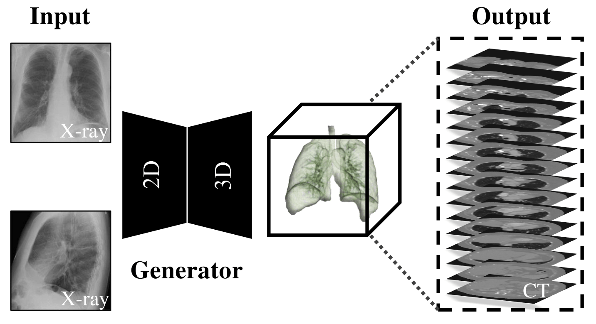
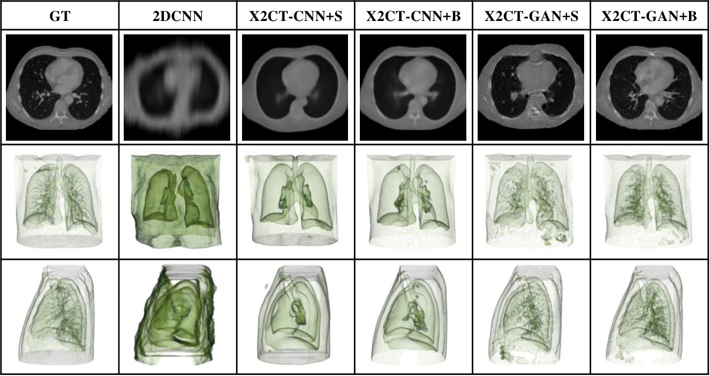

# X2CT-GAN: Reconstructing CT from Biplanar X-Rays with Generative Adversarial Networks

## Introduction
-----
This is the official code release of the 2019 CVPR paper <a href="https://arxiv.org/abs/1905.06902">X2CT-GAN: Reconstructing CT from Biplanar X-Rays with Generative Adversarial Networks</a>. In the original paper, we proposed a novel method to reconstruct CT from two orthogonal X-Ray images using the generative adversarial network (GAN). A specially designed generator network is exploited to increase data dimension from 2D (X-Rays) to 3D (CT), which has not been addressed in previous research works. In this code release, we provide the complete source codes, trained models and related LIDC data that are used in our experiments, which may help you validate our method as well as several baselines. You can also use the source code to process the data and retrain all the networks. 

<div align=center>

</div>

### License
This work is released under the GPLv3 license (refer to the LICENSE file for more details).

### Citing our work
```
@InProceedings{Ying_2019_CVPR,
author = {Ying, Xingde and Guo, Heng and Ma, Kai and Wu, Jian and Weng, Zhengxin and Zheng, Yefeng},
title = {X2CT-GAN: Reconstructing CT From Biplanar X-Rays With Generative Adversarial Networks},
booktitle = {The IEEE Conference on Computer Vision and Pattern Recognition (CVPR)},
month = {June},
year = {2019}}
```

## Contents
----
1. [Requirements](#Requirements)
2. [Installation](#Installation)
3. [Code Structure](#Structure)
4. [Demo](#Demo)
5. [Results](#Results)
6. [TODO](#TODO)
7. [Acknowledgement](#Acknowledgement)

## Requirements
----
1. pytorch>=0.4 versions had been tested 
2. python3.6 was tested
3. python dependencies, please see the requirements.txt file
4. CUDA8.0 and cudnn7.0 had been tested

## Installation
----
- Install Python 3.6.0
- pip install -r requirements.txt
- Install pytorch 0.41 or above
- Make sure CUDA and cudnn are installed
- Download preprocessed dataset and our model files: <a href="https://share.weiyun.com/5xRVfvP">weiyun</a>
- Download the source code and put the data file to the right location according to the code structure below

## Structure
----
```
CTGAN/:
   |--data/:folder include all the preprocessed data and train/test split in our original experiment
   |    |--LIDC-HDF5-256/:include the raw data .h5 file
   |    |--train.txt:training file list
   |    |--test.txt:test file list
   |
   |--experiment/: experiment configuration folder
   |    |--multiView2500/: multiview experiment configuration file
   |    |--singleView2500/: singleview experiment configuration file
   |
   |--lib/:folder include all the dependency source codes
   |    |--config/: folder includes the config file
   |    |--dataset/: folder includes the source code to process the data
   |    |--model/: folder includes the network definitions and loss definitions
   |    |--utils/: utility functions
   |
   |--save_models/: folders include trained modesl from us
   |    |--multiView_CTGAN/: single view X-Ray to CT model
   |    |--singleView_CTGAN/: Biplanar X-Rays to CT model
   |
   |--test.py: test script that demonstrates the inference workflow and outputs the metric results
   |--train.py: training script that trains models
   |--visual.py: same working mechanism as test.py but viualizing the output instead of calculating the statistics 
   |--requirements.txt: python dependency libraries
CT2XRAY/: (Will be released soon.) Convert CT volume to X-Ray images that are used as the training input.
   |--
   |--
   |--
XRAY_TRANSFER/: (Will be released soon.) Cycle-gan based pipeline to make the synthesized X-Ray images more realistic. 
   |--
   |--
   |--
images/: markdown support images
LICENSE
README.md
```

## Demo
----

### Input Arguments
+ --ymlpath: path to the configuration file of the experiemnt
+ --gpu: specific which gpu device is used for testing, multiple devices use "," to separate, e.g. --gpu 0,1,2,3
+ --dataroot: path to the test data
+ --dataset: flag indicating data is for training, validation or testing purpose
+ --tag: name of the experiment that includes the trained model
+ --data: input dataset prefix for saving and loading purposes, e.g. LIDC256 
+ --dataset_class: input data format, e.g. single view X-Rays or multiview X-Rays, see lib/dataset/factory.py for the complete list of supported data input format
+ --model_class: flag indicating the selected model, see lib/model/factory.py for the complete list of supported models
+ --datasetfile: the file list used for testing
+ --resultdir: output path of the algorithm
+ --check_point: the selected training iteration to load the correct checkpoint of the model
+ --how_many: how many test samples will be run for visualization (useful for visual mode only)
+ --valid_datasetfile: the file list used for validation

### Test our Models

Please use the following example settings to test our model. 
 
1. **Single-view Input Parameters for Test Script：**  
python3 test.py --ymlpath=./experiment/singleview2500/d2_singleview2500.yml --gpu=0 --dataroot=./data/LIDC-HDF5-256 --dataset=test --tag=d2_singleview2500 --data=LIDC256 --dataset_class=align_ct_xray_std --model_class=SingleViewCTGAN --datasetfile=./data/test.txt --resultdir=./singleview --check_point=30 --how_many=3   
2. **Multi-view Input Parameters for Test Script：**  
python3 test.py --ymlpath=./experiment/multiview2500/d2_multiview2500.yml --gpu=0 --dataroot=./data/LIDC-HDF5-256 --dataset=test --tag=d2_multiview2500 --data=LIDC256 --dataset_class=align_ct_xray_views_std --model_class=MultiViewCTGAN --datasetfile=./data/test.txt --resultdir=./multiview --check_point=90 --how_many=3

### Train from Scratch
Please use the following example settings to train your model. 

1. **Single-view Input Parameters for Training Script：**  
    python3 train.py --ymlpath=./experiment/singleview2500/d2_singleview2500.yml --gpu=0,1,2,3 --dataroot=./data/LIDC-HDF5-256 --dataset=train --tag=d2_singleview2500 --data=LIDC256 --dataset_class=align_ct_xray_std --model_class=SingleViewCTGAN --datasetfile=./data/train.txt --valid_datasetfile=./data/test.txt --valid_dataset=test
2. **Multi-view Input Parameters for Training Script：**  
    python3 train.py --ymlpath=./experiment/multiview2500/d2_multiview2500.yml --gpu=0,1,2,3 --dataroot=./data/LIDC-HDF5-256 --dataset=train --tag=d2_multiview2500 --data=LIDC256 --dataset_class=align_ct_xray_views_std --model_class=MultiViewCTGAN --datasetfile=./data/train.txt --valid_datasetfile=./data/test.txt --valid_dataset=test

## Results
----
Qualitative results from our original paper. 
<div align=center>

</div>

## TODO
----
- [x] Traing code example and script of the algorithm  
- [x] Testing code example and script of the algorithm
- [x] Visualization code example and script of the algorithm
- [x] Pre-processed LIDC data upload to cloud (70G, training and test data used in the CVPR work)
- [x] Source code to generate synthesized X-Rays from CT volumes
- [ ] Source code to generate realistic X-Rays by using CycleGAN

## Acknowledgement
----
We thank the public <a href="https://wiki.cancerimagingarchive.net/display/Public/LIDC-IDRI">LIDC-IDRI dataset </a> that is used to build our algorithm. 